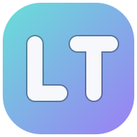
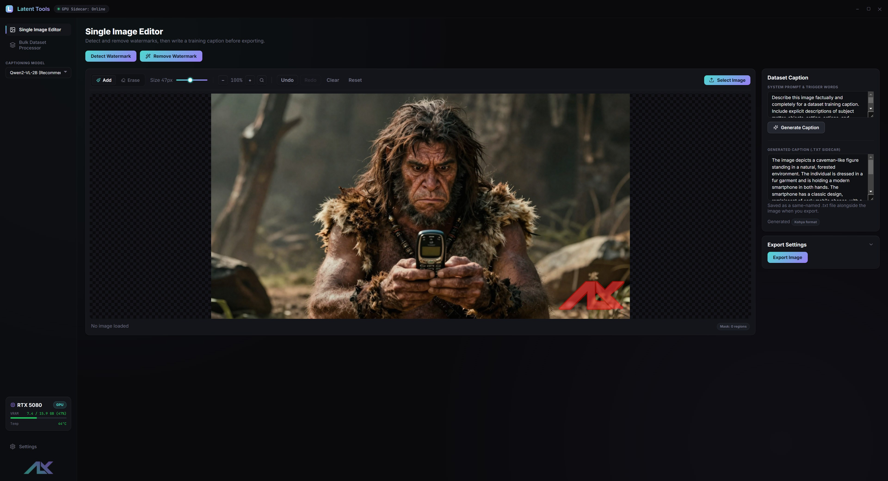
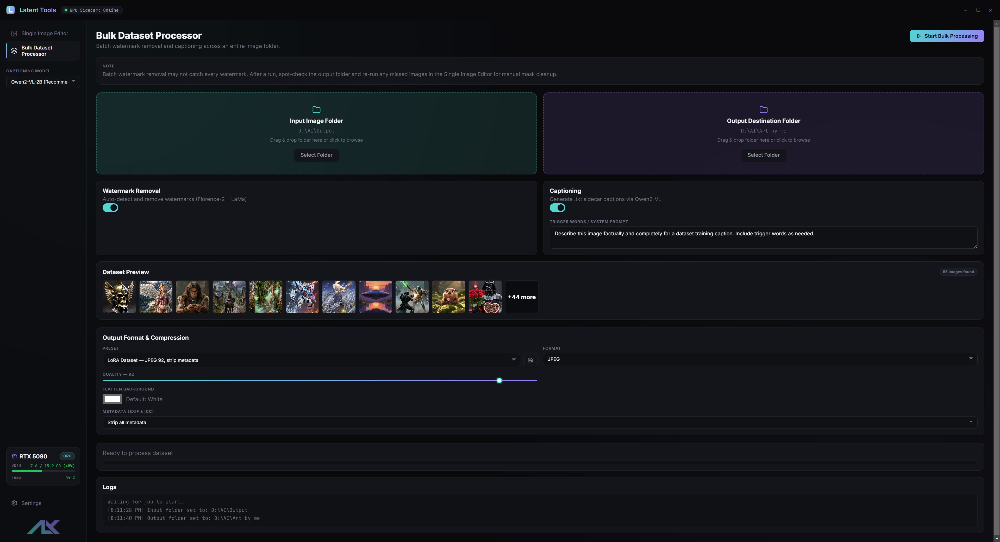
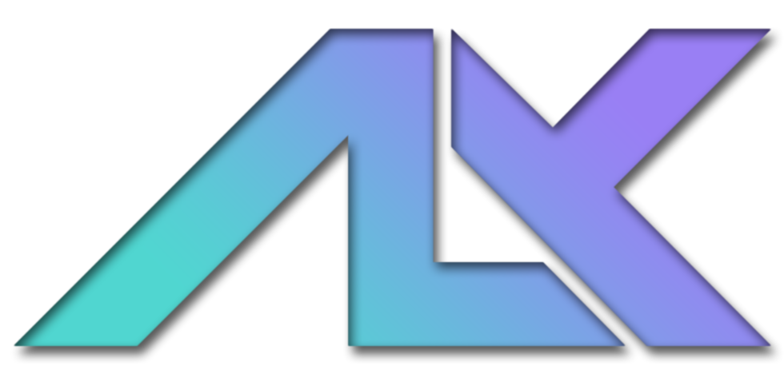

  

# Latent Tools

A local-first, on-device desktop application for bulk image dataset preparation: automated AI watermark detection and removal, multi-format image conversion (JPEG/PNG/WEBP), and uncensored training dataset captioning—running entirely offline powered by an embedded Python GPU sidecar.

---

## 📸 Interface

  
   
  <i><b>Single Image Editor:</b> Detect and remove watermarks on an interactive mask canvas, then write/generate and export a training caption.</i>

  
   
  <i><b>Bulk Dataset Processor:</b> Batch watermark removal and captioning across an entire image folder, with real-time progress and logs.</i>

---

## ⚠️ Disclaimer & Responsible Use

Latent Tools is built to remove watermarks **you have the rights to remove** — your own marks, marks on images you own or are licensed to edit, or marks on assets you otherwise have permission to modify. It is **not** a tool for stripping copyright, attribution, or ownership marks from other people's work.

Watermarks, credit lines, and similar overlays can constitute Copyright Management Information (CMI) under 17 U.S.C. § 1202 (and analogous laws elsewhere). Removing or altering CMI from a work without the rightsholder's authority — or knowingly distributing an image after doing so — can carry legal liability independent of ordinary copyright infringement, and can attach to the person who did the removal even where the underlying use might otherwise be permitted. This software performs no rights checking of any kind: it does not verify that you own, license, or are otherwise authorized to modify any image you feed into it. That determination is entirely yours to make **before** you process an image, not after.

You are solely responsible for ensuring you have the legal right to edit any image you process with this tool, including the right to remove any watermark, credit line, or CMI it contains. The authors and contributors accept no liability for misuse, and provide no warranty that use of this tool complies with copyright law, the DMCA, or any other applicable law in your jurisdiction.

### Third-party models — separate licenses, not covered by this repo's MIT grant

This repository's own code is MIT-licensed with a Commons Clause condition (see [LICENSE](LICENSE)). At runtime, the sidecar downloads and runs third-party model weights from Hugging Face that are **not** part of that grant and carry their own license terms — read them before commercial or redistributive use:

* **Florence-2** (`microsoft/Florence-2-base`) — MIT.
* **Qwen2-VL** (`Qwen/Qwen2-VL-2B-Instruct` / `Qwen/Qwen2-VL-7B-Instruct`) — Tongyi Qianwen license, which imposes use-based restrictions (including a large-scale-commercial-use threshold); review Qwen's license terms directly if that applies to you.
* **IOPaint / LaMa** — see the `iopaint` package and upstream LaMa licensing.

Using a custom local model in place of the defaults shifts responsibility for that model's license onto whoever supplies it.

---

## 🔐 Fast, Portable & Safe

Engineered for AI trainers and dataset creators preparing image libraries for LoRA, Fine-Tuning, and ControlNet models with zero cloud dependency.

* **100% Local & On-Device Execution:** All inference models (Florence-2, IOPaint/LaMa, Qwen2-VL) run locally on your RTX GPU. Your images and dataset descriptions never leave your computer.
* **Secure Loopback Architecture:** The Electron UI communicates with the embedded Python engine over a `127.0.0.1`-only HTTP loopback (default port `8756`, configurable via `LATENT_SIDECAR_PORT`). It never binds an external interface or requires open internet access during processing.
* **First-Class Bulk Folder Processing:** Designed from day one to handle entire image dataset folders in batch mode—not just single one-off edits—with native folder drag-and-drop.
* **Non-Destructive Sidecar Generation:** Text captions are exported as atomic `.txt` sidecar files (Kohya / Automatic1111 format) named identically to the destination image files, ensuring zero data loss.
* **Precise Area & Box Filtering:** Automated watermark detection filters out giant false-positive background boxes, combining multiple text watermarks into clean masks without destroying subject geometry.

---

## ✨ Key Features

* **Automated AI Watermark Removal:**
  * Uses `microsoft/Florence-2-base` open-vocabulary object detection to locate text watermarks, logos, and stamps.
  * Inpaints masked regions seamlessly on-device using `IOPaint` (LaMa model).
* **Interactive Canvas Mask Editor:**
  * Fine-tune AI-generated masks on an interactive visual overlay canvas.
  * Smooth **Add Mask** and **Erase Mask** brush tools with real-time size adjustments, mousewheel zoom, and click-and-drag panning.
  * Unlimited **Undo / Redo** history (`Ctrl+Z`, `Ctrl+Shift+Z` / `Ctrl+Y`) with **Clear** and **Reset** controls; the brush stays live immediately after a removal pass for touch-up masking.
  * Convenient **Select Image** button positioned directly at the top-right corner of the canvas mask toolbar.
* **Uncensored Dataset Captioning:**
  * Powered by `Qwen/Qwen2-VL-2B-Instruct` (default, faster) or `Qwen/Qwen2-VL-7B-Instruct` (higher quality), selectable per-request — or point it at your own local model folder.
  * Custom system prompts and trigger words bypass false-positive safety refusals on uncensored dataset art while maintaining objective description quality.
  * Captions export as atomic `.txt` sidecar files (Kohya / Automatic1111 format) named identically to the destination image.
* **Multi-Format Dataset Conversion:**
  * Convert images to **PNG**, **JPEG**, or **WEBP**.
  * Adjust quality sliders (1–100), WEBP lossless mode, and PNG compression levels (0–9).
  * Custom background flattening color pickers for transparent images.
  * Comprehensive EXIF & ICC metadata handling (`strip`, `keep`, `strip_except_orientation`).
  * LoRA / Archive / Web export presets plus your own `localStorage`-backed custom presets.
* **First-Class Bulk Dataset Processing:**
  * Native **Drag & Drop** folder dropzones for both Input and Output destination folders (or click to browse).
  * Real-time thumbnail preview grid and scanning count.
  * Single HTTP round-trip processing (`/process`) per image for maximum bulk throughput.
  * Real-time progress bar and live log terminal during processing.
* **Unified Latent Design System:**
  * Dark graphite canvas (`#0A0A0D`) with step-up flat surface levels (`#14151B` / `#23252F`), desaturated **Latent Cyan** (`#4FD8D0`) & **Latent Violet** (`#9B7EF5`) accents, and the signature Latent brand gradient.
  * Frameless titlebar (`52px`) with standard Latent brand gradient rounded square logo, window controls, and live **GPU Sidecar Health Status Pill** (`Starting...`, `Online`, `Offline`).
  * Sidebar (`224px`) with active navigation indicator bar, white active icon strokes, and live GPU VRAM usage bar widget.
  * `Ctrl` + mousewheel UI zoom (50%–250%, `Ctrl+0` to reset) and dark-themed native dropdowns throughout.
  * System tray icon with Show/Quit controls.

---

## 💻 System Requirements

* **OS:** Windows 10/11 (64-bit). Prebuilt releases and the packaged build config
  (`electron-builder`) target Windows only; there is no macOS/Linux CI build or
  installer today.
* **GPU:** NVIDIA discrete GPU (8GB+ VRAM recommended). There is no CPU fallback —
  the sidecar requires CUDA.
* **RAM:** 16GB minimum (32GB recommended for large 7B VLM models).
* **Storage:** ~10GB for Python environment and local AI weights.
* **Runtime (source builds only):** Node.js v20+ & Python 3.11+.

---

## 🛠️ Technical Architecture

Latent Tools combines an Electron frontend with an embedded Python FastAPI sidecar process.

* **Frontend & Main (Electron + TypeScript):**
  * **Strict TypeScript:** Compiled with strict type safety across main, preload, and renderer processes.
  * **ContextBridge IPC:** Secure, isolated IPC channels (`folder:select`, `folder:list-images`, `bulk:process-item`, `image:import`, `image:detect`, `image:inpaint`, `image:caption`, `image:export`, `image:save`, `mask:update`, `gpu:status`, window controls).
  * **Interactive Canvas:** Hardware-accelerated HTML5 canvas mask rendering and undo history stack.

* **GPU Sidecar (Python 3.11 + PyTorch):**
  * **FastAPI Service:** Uvicorn engine bound to `127.0.0.1` loopback only, exposing `/health`, `/gpu`, `/normalize`, `/detect`, `/inpaint`, `/caption`, `/convert`, `/process` (single-round-trip detect→inpaint→caption→convert used by bulk processing), and `/shutdown`.
  * **Florence-2 (`microsoft/Florence-2-base`):** Bounding box & open-vocabulary watermark detection with adaptive Canny stroke contouring.
  * **IOPaint (LaMa):** Fast Fourier Transform-based resolution-agnostic inpainting.
  * **Qwen2-VL (`Qwen/Qwen2-VL-2B-Instruct` or `Qwen/Qwen2-VL-7B-Instruct`, or a custom local model folder):** Multi-modal vision language model for captioning, selectable per-request.
  * **OpenCV & Pillow:** Image normalization, mask dilation, and multi-format encoding.
  * **PyInstaller:** Compiles the sidecar to a standalone `sidecar.exe` for packaged releases — no Python install required by end users.

---

## 📦 Downloads for End Users

Prebuilt standalone Windows executables are published on the **[Releases Page](https://github.com/erroralex/Latent-Tools/releases)**:

* **Portable Standalone (`Latent-Tools.exe`):** **No installation required & no Python setup required.** Simply download, double-click, and run immediately.
* **Installer (`Latent-Tools-Setup.exe`):** Optional standard Windows installer with Start Menu shortcuts and uninstaller if you prefer a traditional desktop installation.

Both prebuilt downloads come fully self-contained with the compiled GPU sidecar bundled inside.

---

## 📜 License

Distributed under the **MIT License**. Free for personal use.

---

## 💖 Support the Project

If **Latent Tools** has saved you hours of manual dataset prep and watermark removal, consider supporting its ongoing development.

---

  <b>Developed by</b> 
   
  Copyright (c) 2026 Alexander Nilsson

